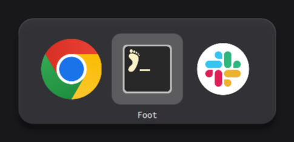

# Omarchy AltTab

A compact, macOS-style **Alt+Tab application switcher** for Omarchy.
Hold Alt, tap Tab to choose an app, then release Alt to switch.

One icon per running application, a quiet selection highlight, and a label under
the selected app. It appears only while switching and runs inside the existing
Omarchy shell.



Actual switcher on a plain background; appearance depends on your icon theme.

## Behavior

| Input | Action |
| --- | --- |
| Alt+Tab | Open the switcher / select the next app |
| Alt+Shift+Tab | Select the previous app |
| Release Alt | Activate the selected app |
| Left / Right | Move the selection while open |
| Enter | Activate the selected app |
| Escape | Cancel and keep the current focus |
| Hover / click | Select / activate an app |

- Groups windows by desktop application across workspaces and monitors.
- Orders applications by recent focus and activates the selected app's most
  recently used surviving window. Browsing the strip keeps that order fixed.
- Uses installed desktop entries for app names and system icons, with a fallback
  for unknown applications.
- Removes closed windows while open; takes a fresh snapshot on the next opening.
- Centers on the focused monitor. Icons shrink and the row scrolls when needed.
- Uses 80 px icons, rounded dark material, and a soft shadow. Background blur
  follows the compositor's blur setting. Labels use UbuntuMono Nerd Font when
  installed, otherwise Qt's font fallback.

## Requirements

Tested with **Omarchy 4.0.3 and Hyprland 0.56.2**, using Omarchy's Quickshell-based
shell and Lua configuration. Older Hyprland versions with only `.conf` bindings
are not supported. This is an Omarchy shell service plugin, not a standalone
Hyprland binary plugin. It needs no build step or additional daemon.

## Install

Add and enable the plugin:

```sh
omarchy plugin add https://github.com/charleszheng44/omarchy-alttab.git --enable
```

Add this line **once, at the end** of `~/.config/hypr/bindings.lua`:

```lua
dofile(os.getenv("HOME") .. "/.config/omarchy/plugins/zc.app-switcher/hyprland.lua")
```

The plugin ID is `zc.app-switcher`; Omarchy uses that ID for its install folder.
The Lua file replaces the default Alt+Tab and Alt+Shift+Tab bindings, listens for
Alt release, and configures the switcher's layer. Then apply and check:

```sh
hyprctl reload
hyprctl configerrors
```

If upgrading from the initial manually installed version, remove its existing
`require("hypr.app-switcher")` line before adding the `dofile` line, and back up
the old plugin folder outside `~/.config/omarchy/plugins/` before installing.
Load only one copy of the keybindings.

## Update or remove

```sh
omarchy plugin update zc.app-switcher
hyprctl reload
hyprctl configerrors
```

If the shell retains an older QML component after an update, run
`omarchy restart shell` to load the new version.

To remove, delete the `dofile` line from `bindings.lua`, then run:

```sh
hyprctl reload
hyprctl configerrors
omarchy plugin remove zc.app-switcher
```

Reloading without this binding file restores the bindings from your remaining
Hyprland configuration.

## Development

`Switcher.qml` provides the panel and input handling. `Model.js` groups and orders
applications. `hyprland.lua` sends key events through Hyprland's ordered event
socket, including Alt release; a fast release before the window query finishes
still commits the selection. There is no periodic window polling.

Run the model checks with Node.js, and validate the manifest on Omarchy:

```sh
node model.test.cjs
omarchy plugin validate .
luac -p hyprland.lua
```

The model checks cover application grouping, desktop identity aliases, recent
window selection, unknown apps, closing windows, empty/single-app lists, and
reverse wraparound. These checks do not replace a live desktop test.

The running plugin exposes IPC calls for a manual check:

```sh
omarchy-shell zc-app-switcher next
omarchy-shell zc-app-switcher state
omarchy-shell zc-app-switcher cancel
```

Before releasing, also check physical Alt+Tab and Alt+Shift+Tab, fast Alt release,
Escape, Enter, multiple workspaces, and closing a selected window.

## License

[MIT](LICENSE).
